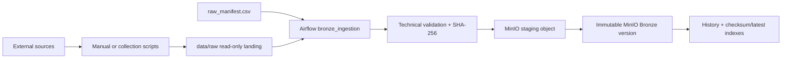

# Agricultural Export Data Lakehouse

This graduation project implements a data lakehouse for Vietnam's agricultural
export supply chain, initially covering coffee, pepper, and natural rubber.

## Week 7 architecture

Week 7 implements only the local landing-to-Bronze boundary. External source
collection happens before the Airflow DAG starts. `data/raw` is the repository
landing area; it is not the Bronze layer. Bronze is the `bronze` bucket in
MinIO.



The ingestion DAG never downloads normal production data from Google Drive and
does not require Google credentials. [`scripts/download_drive_data.ps1`](scripts/download_drive_data.ps1)
and [`data/drive_manifest.csv`](data/drive_manifest.csv) remain optional,
separate collection utilities that can populate the local landing area.

## Local raw inventory

[`data/raw_manifest.csv`](data/raw_manifest.csv) is the only control plane for
normal Bronze ingestion. It addresses 26 enabled local files in eight groups:

| Group | Source | Files |
| --- | --- | ---: |
| 01 | FAOSTAT Production | 3 |
| 02a | FAOSTAT Producer Prices Annual | 3 |
| 02b | FAOSTAT Producer Prices Monthly | 3 |
| 03 | FAOSTAT Detailed Trade Matrix | 3 |
| 04 | FAOSTAT TCL Trade | 3 |
| 05 | UN Comtrade Annual and Monthly | 2 |
| 06 | World Bank Pink Sheet and WDI | 2 |
| 07 | NASA POWER Weather | 1 |
| 08 | Provincial Agriculture | 6 |

There are 21 CSV and 5 XLSX files. They total 102,125,849 bytes; the largest is
the 83,581,646-byte NASA POWER file with 614,754 data rows. Hashing, CSV
inspection, and MinIO upload use streaming/file IO rather than buffering the
whole source in application memory.

Current raw layout:

```text
data/raw/
  faostat/
    production/
    prices/
      annual/
      monthly/
    trade_matrix/
    tcl/
  un_comtrade/
  world_bank/
  nasa_power/
  provincial/
    coffee/
    all_crops/
```

The three additional coffee workbooks already collected by the project are
retained under `provincial/coffee` instead of being deleted.

Materialize this exact layout from the Drive manifest with:

```powershell
pwsh -File ./scripts/download_drive_data.ps1
```

On a machine that still has the old raw layout, back it up first and then use:

```powershell
pwsh -File ./scripts/download_drive_data.ps1 -Prune
```

`-Prune` removes files under `data/raw` that are not present in
`drive_manifest.csv`; omit it when local unconfigured files must be retained.

Do not rename, rewrite, delete, clean, or normalize these source files during
ingestion. Airflow mounts `data/raw` at `/opt/airflow/data/raw` read-only.

### Raw manifest fields

Required fields:

- `dataset_id`: stable and unique source identity.
- `source_system`: producer such as `faostat`, `world_bank`, or `nasa_power`.
- `relative_path`: source location relative to `data/raw`.
- `source_file_name`: exact basename of `relative_path`.
- `file_format`: `csv` or `xlsx`.
- `enabled`: whether the source participates in normal runs.

Optional descriptive fields are `source_group`, `commodity`, `frequency`,
`bronze_dataset`, and `notes`. Manifest validation rejects missing fields,
duplicate IDs/paths, unsupported formats, basename mismatches, absolute paths,
and path traversal. Runtime resolution also rejects symlinks that escape the
configured raw root.

## Full and incremental loading

The complete file is always the ingestion unit; Week 7 does not implement
row-level CDC.

| State | Detection | Result |
| --- | --- | --- |
| `NEW` | Dataset has no prior successful version | `FULL` + `SUCCESS` |
| `UNCHANGED` | Dataset and SHA-256 already succeeded | `INCREMENTAL` check + `SKIPPED` |
| `CHANGED` | Dataset exists but SHA-256 is new | `INCREMENTAL` + `SUCCESS` |

A changed source creates a new immutable Bronze object. Earlier successful
objects and metadata remain available. Airflow retries reuse a deterministic
ingestion ID for the same run and dataset, so a retry cannot create an extra
final version.

## Bronze and metadata layout

Data objects:

```text
bronze/{source_system}/{bronze_dataset}/
  ingestion_date=YYYY-MM-DD/
    ingestion_id={ingestion_id}/{source_file_name}
```

Technical control objects in the same bucket:

```text
_metadata/ingestion_history/{dataset_id}/{event}.json
_metadata/run_results/{airflow_run_key}/{dataset_id}.json
_metadata/success_index/{dataset_id}/{checksum_sha256}.json
_metadata/latest_success/{dataset_id}.json
```

Every final result contains `ingestion_id`, `dataset_id`, `source_system`,
`source_file_path`, `source_file_name`, `file_size_bytes`,
`source_modified_time`, `checksum_sha256`, `bronze_path`, `load_type`,
`change_state`, `ingested_at`, `airflow_run_id`, `status`, and `error_message`.
Optional technical fields include row count, schema hash, source group,
commodity, frequency, and error type.

Only `SUCCESS`, `SKIPPED`, and `FAILED` are persisted as final statuses. A
`SUCCESS` record is written only after the final Bronze object is fully
published. Failed staging objects are removed where possible and are never
treated as ready data.

## Technical validation

Before publication the service checks that:

- the resolved path remains underneath `data/raw`;
- the path exists and is a regular, non-empty file;
- manifest extension and format agree;
- SHA-256 can be calculated with chunked reads;
- CSV is valid UTF-8 with a readable header, or XLSX has a valid workbook ZIP
  structure;
- size and modified time remain stable during inspection and upload.

These are technical checks only. The pipeline does not rename columns, cast
business values, standardize names or units, remove duplicates, fill nulls,
join sources, or calculate KPIs.

## Configuration and startup

Copy the environment example and replace local development secrets before any
shared deployment:

```bash
cp .env.example .env
```

The relevant variables are `MINIO_ROOT_USER`, `MINIO_ROOT_PASSWORD`,
`POSTGRES_PASSWORD`, `AIRFLOW_FERNET_KEY`, `AIRFLOW_JWT_SECRET`, and the optional
`BRONZE_DAG_SCHEDULE`. Leaving the schedule blank keeps ingestion manual-only.

MinIO server and `mc` are built into one local image from pinned official source
releases because the archived public images now reject anonymous pulls. The
first build takes longer while Go compiles both binaries. This follows MinIO's
[upstream source-build guidance](https://github.com/minio/minio#build-docker-image).


Start the platform:

```bash
docker compose up -d --build
docker compose ps
docker compose exec airflow-scheduler airflow dags list-import-errors
```

Local endpoints include Airflow at <http://localhost:8083>, MinIO API at
<http://localhost:9000>, MinIO Console at <http://localhost:9001>, and Trino at
<http://localhost:8082>.

## Run the Bronze DAG

Full enabled manifest:

```bash
docker compose exec airflow-scheduler airflow dags unpause bronze_ingestion
docker compose exec airflow-scheduler airflow dags trigger bronze_ingestion
```

One dataset:

```bash
docker compose exec airflow-scheduler airflow dags trigger bronze_ingestion \
  --conf '{"dataset_id":"faostat_production_coffee"}'
```

Several selected datasets:

```bash
docker compose exec airflow-scheduler airflow dags trigger bronze_ingestion \
  --conf '{"dataset_id":["faostat_production_coffee","world_bank_wdi"]}'
```

The DAG permits one active run and up to four mapped ingestion tasks. Each
source task has two retries with exponential backoff and a 30-minute timeout.
The final summary reports status, change state, load type, and any missing
dataset results.

## Demo sequence

1. Confirm all enabled manifest paths exist under `data/raw`, start the stack,
   and trigger the DAG. Empty Bronze should yield `NEW`, `FULL`, `SUCCESS`.
2. Trigger it again without changing local raw files. Results should be
   `UNCHANGED`, `SKIPPED`, with no new data objects.
3. Back up and replace one configured local source with a legitimate newer
   source version, trigger again, and verify `CHANGED`, `INCREMENTAL`,
   `SUCCESS` while the old Bronze object remains. Restore the source afterward
   if this is only a demonstration.

## Tests

Run deterministic host tests and configuration validation:

```bash
PYTHONPATH=airflow/include python3 -m unittest discover -s tests -v
PYTHONPYCACHEPREFIX=/tmp/tlcn-pycache python3 -m compileall -q \
  airflow/include airflow/dags tests
docker compose config --quiet
```

The tests cover manifest inventory, safe path resolution, Full Load,
unchanged skip, changed-file Incremental Load, missing/empty/corrupt sources,
retry safety, metadata fields, XLSX structure, and the real large NASA file.
